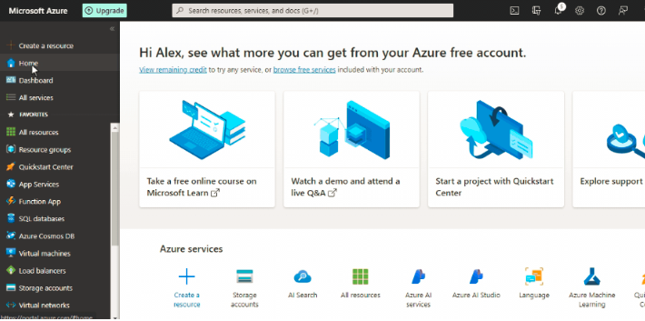
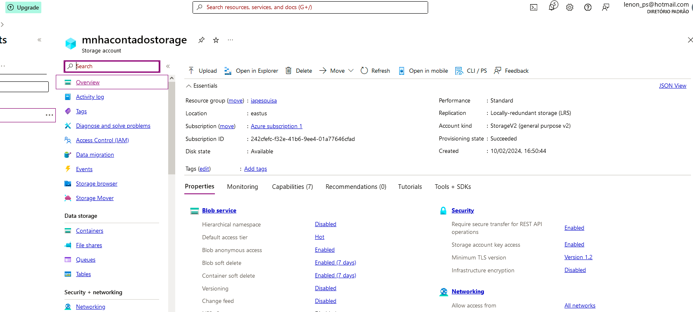
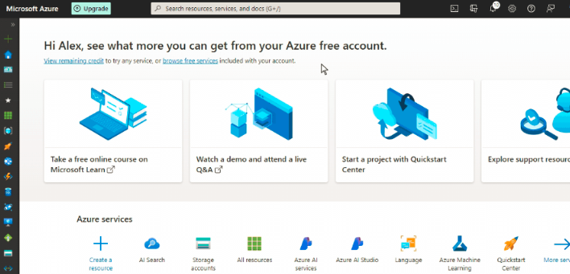

Azure Cognitive Search: Utilizando AI Search para indexação e consulta de Dados
Problema:

O desafio propoe que seja criada uma pesquisa que funcione juntamente com um serviço de inteligência artificial para identificar palavras chave, sentimentos, utilizando também o serviço de armazenamento do azure.

Documentação
Passo 1: Criando recurso do Asure AI Search:

Passo 3: Criando o storage:

Passo 3: Permitindo acesso anônimo ao Blob:

Como nosso laboratório é apenas didático,para aprender os princípios da inteligência artificial com o Azure, precisamos permitir o acesso anônimo ao blob para simplificar e facilitar nossas implementações, Após criar o seu Storage, entre no mesmo e navegue até a guia SETTINGS > CONFIGURATION seguindo os passos abaixo:

Passo 5: Criando o Container:

Navegue até a guia DATA STORAGE > CONTAINERS, para criar o contanier dentro do storage e adicionar as pesquisas que seram analisadas pelo AI SERVICE.

Passo 6: Importação e indexação dados para o AI SEARCH:

Neste ponto você precisa linkar / importar os dados que você inseriu e configurou no seu STORAGE, volte para o AI SEARCH e siga os passos abaixo:

Esta é a parte mais importante de todo o processo, assim como o bootcamp fala são muitos passos que que você precisa seguir a risca, achei apenas uma diferença da documentação oficial para o que achei quando configurei o meu.

Ao seguir a Documentação você chegará em INDEX DOCUMETS, o qual o gif acima mostra o início do processo, siga os topicos até chegar na sessão 4:

4. In the Attach Cognitive Services section, select your Azure AI services resource.

Note que a instrução manda que selecionemos o recurso AI SERVICE configurado, porém para mim não mostrou nenhum, apenas uma informação dizend que meu acesso era gratúitoe que as configurações são limitadas, não se preocupe e pode passar para o passo 5 . In the Add enrichments section.

Siga todas as configurações terminando no passo 17 . Select the indexer name to see more details.
Passo 7: Cnsultando o índice:

Feitas todas as configurações vamos voltar ao AZURE AI SERVICES, entrar no nosso serviço e através do SEARCH EXPLORER testar se tudo foi indexado e se a consulta esta funcionando, utilizando os comandos:

search=*&$count=true    (  verifica se a indexação esta funcionando e mostra os documentos )

search=locations:'Chicago' ( Consulta as ocorrencias acontecidas em Chicado )

search=sentiment:'negative' ( Consulta as ocorrencias com sentimento negativo )

Observações finais:

As ferramentas de inteligÇencia artificial do Azure facilitam a consulta emdocumentos, pesquisas e depoimentos, agilizando ainda mais a consulta de satisfação de empresas sobre seus produtos e serviços.

