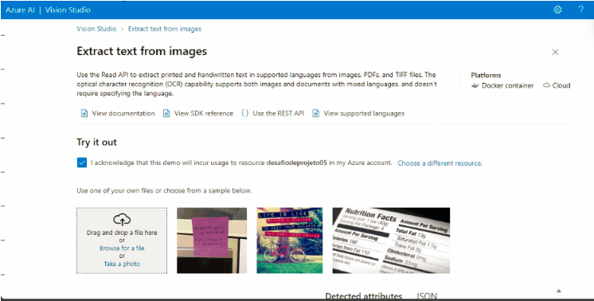

Explorando os Recursos de IA Generativa
Situação problema

Através do conhecimento adquirido no bootcamp, utilize os recursos de IA do Azure para reconhecer textos presentes emimagens imagens:

    Crie uma pasta chamada 'inputs' e salve as imagens que você utilizará.
    Crie uma pasta chamado 'outputs' e salve os resultados de reconhecimento de texto nessas imagens.

De acordo com a proposta utilizaremos os recursos de reconhecimento de imagens do Azure AI Vision Studio!
Passo 1: Criando recurso do Azure AI Services

Primeiro precisei criar um recurso de inteligência virtual, pesquisei por Azure AI Services no marketplace, após encontrar o recurso cliquei em criar.

Passo 2: Abrindo e configurando o Portal AI Vision Studio

Após criar o seu serviço de inteligencia virtual do Azure, nasta abrir o Azure AI Vision Studio e selecionar o serviço de inteligência artificial que acabamos de criar, feito isto ja esta tudo pronto para utilizarmos as nossas imagens.

Passo 3: Utilizando as nossas imagens no serviço Azure AI Vision Studio

Feitas todas as configurações, basta apenas selecionar a guia OPTICAL CHARACTER RECOGNITION e escolher a opção EXTRACT TEXT FROM IMAGES:
Imagem 01:

Imagem 02:

Imagem 03:

Imagem 04:

Imagem 05:

Considerações finais

O recurso de reconhecimento e extração de textos em imagens do Azure possibilita que as empresas o utilizem para reconhecimento e arquivamento de documentos com agilidade e segurança, podendo ser empregado também em notas ficais, necessitando apenas que a imagem do documento seja inserida na ferramenta e seus dados ja são reconhecidos.
