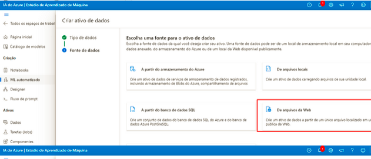
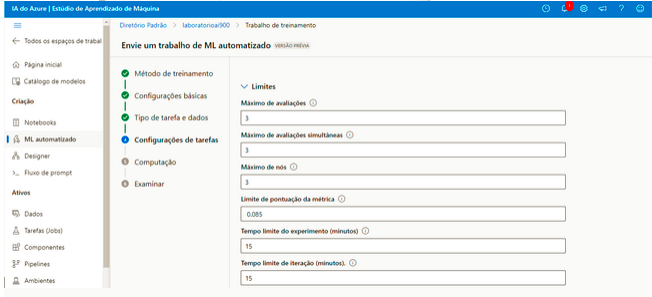

 Trabalhando com Machine Learning
Criando modelo de previsão - Passo a passo

Para trabalhar no machine learn é essencial que você possua um workspace e esta é a tarefa inicial, criar o seu workspace para assim poder criar o seu trabalho automatizado.

Depois que nosso worlspace estiver pronto temos que entrar no ML studio para criar um "novo trabalho de ML automatizado", seguindo o passo a passo da documentação do Learning para melhor entendimento e para que tudo dê certo: 

Vamos criar um aprendizado de maquina para a previsão de aluguel de bicicletas:

O tipo de tarefa é regressão e onome de ativo de dados e aluguel de bicicletas, com fonte de dados da WEB. 

Adocumentação do Learning é bem didática e traz todos os valores e configurações para que o trabalho automatizado seja criado: 

Chegando na opção "examinar" basta enviar o seu trabalho de treinamento: 

Após envio seu trabalho irá passar pelo proxesso de configuração das execuções e após 15, podendo o tempo ser menor, estará concluído: 

Pipeline com as etapas do processo de aprendizado e os testes realizados 

Teste do modelo

Na página do modelo, cliquei na aba "Pontos de extremidade". Também é possível acessar pelo menu lateral em "Pontos de extremidade". Cliquei no ponto correspondente ao modelo gerado. Em seguida, acessei a aba "Testar".

Para o teste, utilizei o json abaixo:

A previsão gerada foi: 361.95

