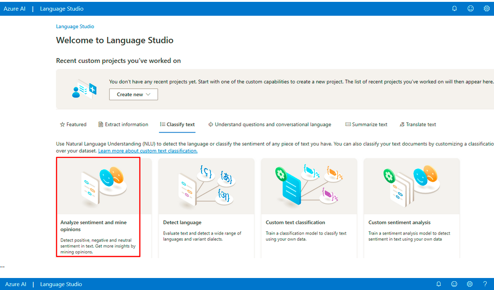
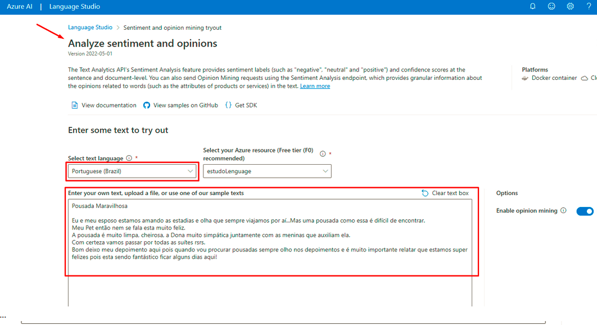
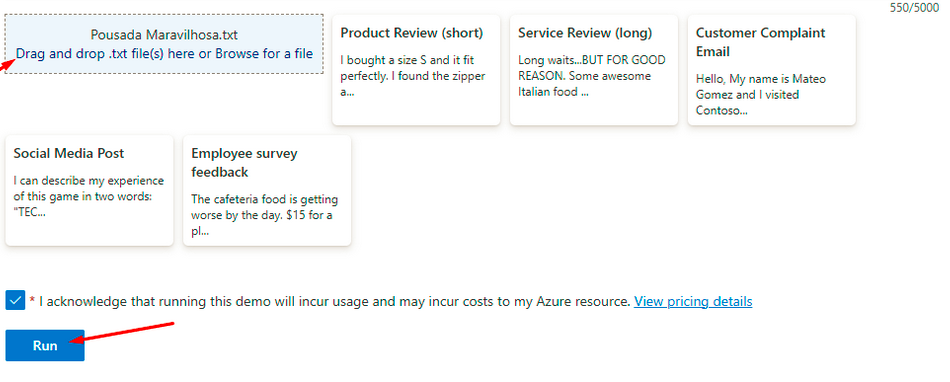
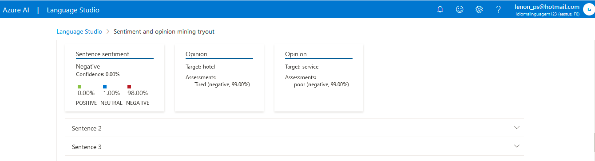
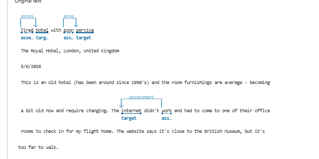

Análise de Sentimentos com Language Studio 

Analyze sentiment and mine opinions

Através deste recurso a Inteligência Artificial analiza textos afim de descobrir o sentimento e satisfação do usuário que o escreveu, assim como as principais opiniões.
01 - Dentro do Language Studio guia Classify test clique na opção Analyze sentiment and mine opinions:

Considerações Finais

Tal recurso facilita bastante o dia da dia das empresas, uma vez que possibilita saber de forma ágil e simples o sentimento dos clientes no que dis respeito aos seus produtos, o que eles mais gostaram, menos gostaram e a possibilidade de voltarem a consumir o produto ou serviço, possibilitando assim a reação rápida por parte da empresa.