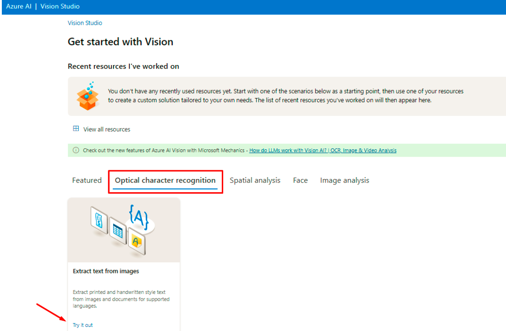

Através deste recurso a Inteligência Artificial descreve o que esta presente na imagem, possibilitando assim que deficientes visuais saibam o que esta presente na foto ou video.

01 - Dentro do Vision Studiona guia Image analysis clique na opção Add captions to imagens:

02 - O recurso trás algumas imagens de exemplo para que você realize testes do serviço e até mesmo a possibilidade de realizar upload de uma foto sua e ter a descrição, no meu caso adicionei uma foto minha para testes e o serviço me retorna a descrição do que identificou na imagem:

Através deste recurso a Inteligência Artificial extrai o texto que conseguir identificar na imagem, extremamente util para o escaneamento de documentos e notas:

01 - Dentro do Vision Studiona guia Optical character recognition clique na opção Extract text from images:

02 - O recurso trás algumas imagens de exemplo para que você realize testes do serviço e até mesmo a possibilidade de realizar upload de uma , logo após o upload todo o texto contido na imagem aparece a direita:

este sistema enriquece ainda mais sistemas de segurança.